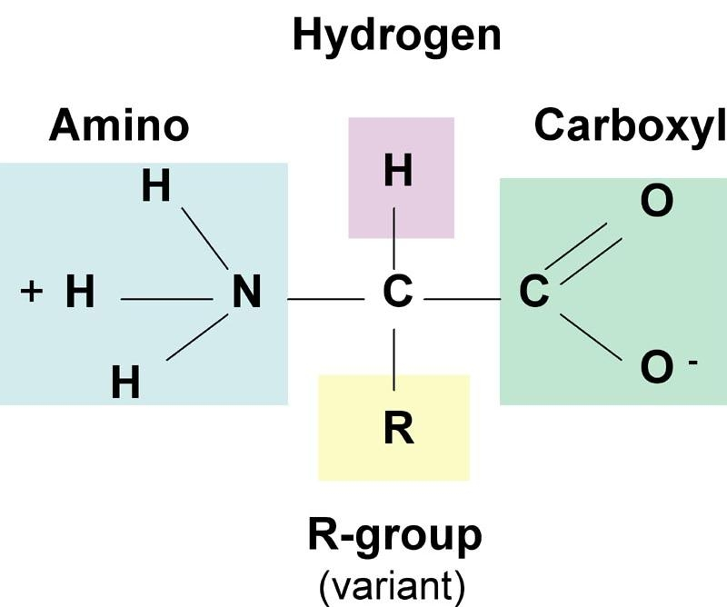
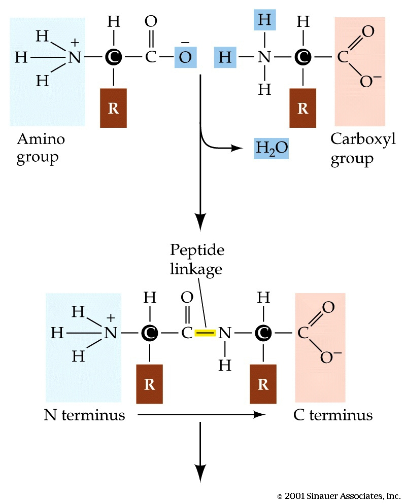
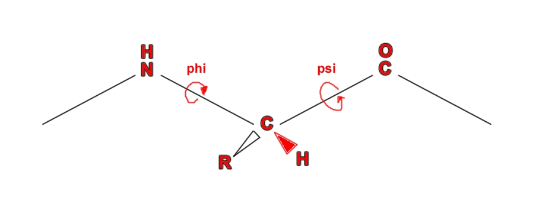
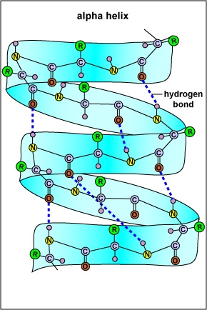
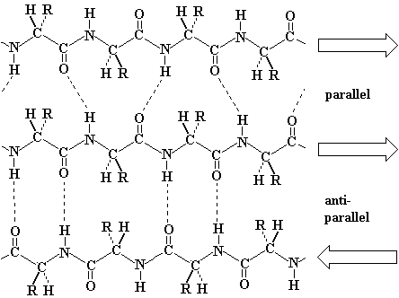
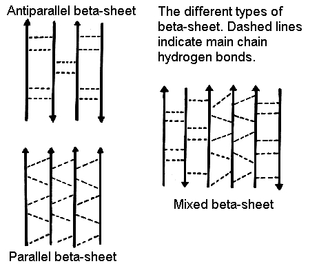
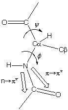
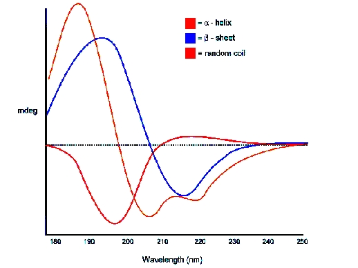
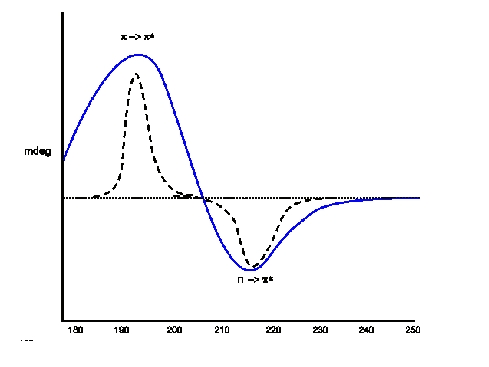
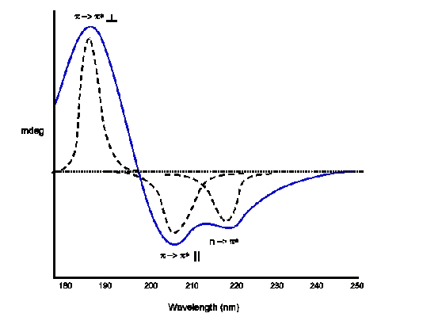

**Introduction to proteins:**

     **Biological Significance:**

Proteins are the most predominant organic molecules in all living cells with remarkable biological significance. The structure, behaviour and unique qualities of all living beings are the consequence of the protein they contain. Proteins perform the essential and specialized functions in living cells. They are primarily responsible for the structure and strength of the body. According to their biological roles, proteins can be classified into various categories. Some proteins act as enzymes, hormones, blood clotting factors, antibodies etc while some proteins are classified as structural (e.g. collagen & keratin), contractile (e.g. actin & myosin), transport (e.g. haemoglobin & myoglobin) and regulatory proteins (e.g. G-proteins). There are also nutrient and storage proteins which are vital for the growth and survival of living cells.These are the dynamic functions of proteins. Due to their vital functions they are also known as the working horses of cell.
 
     **Structure of proteins:**

The building block of protein molecules is called as amino acid, which occur in 20 different naturally occurring forms. A protein is a chain of amino acids linked together through peptide bonds. All proteins are made up of same set of these 20 amino acids arranged in a specific order. Various combinations of these amino acids account for a variety of proteins occurring naturally. A typical amino acid consist of a primary amino group (-NH2), a carboxyl group (-COOH), a hydrogen atom (-H) and a side-chain (-R) group attached to a central α-carbon atom (-Cα). The structure is as shown below.

Structure of an amino acid

The variation among the amino acids occurs at the R group, which is different in each amino acid displaying different physiochemical properties (e.g. polarity, acidity, basicity, aromaticity, ability to from hydrogen bonds etc). Only Proline differs from this basic structure and has its aliphatic side-chain bonded back onto the amino group and is thus, instead an imino acid. This makes Proline a conformationally rigid molecule.

All of the 20 standard amino acids, except for glycine, have four different groups around the Cα atom and thus are optically active and chiral in nature. These can be distinguished based on the difference in rotation of the place polarised light. Only one of the forms of the isomer (L-isomer) (see [ http://en.wikipedia.org/wiki/Chirality_(chemistry)](http://en.wikipedia.org/wiki/Chirality_(chemistry)) for more details) is found in proteins.

      **The peptide bond:**

As discussed above, a protein is a linear sequence of amino acids linked together by peptide bonds. The peptide bond is a covalent bond between the α-amino group of one amino acid and the α-carboxyl group of another. The formation of peptide bond involves removal of water molecule and hence, amino acids are also referred to as residues. The figure below illustrates a peptide bond formation between two amino acid residues with the removal of water molecule.
   
 

**Peptide bond formation**

The peptide bond has partial double bond character. When two amino acids are joined by a peptide bond, they form a dipeptide.A tripeptide refers to a chain of three amino acids while tetrapeptide is a sequence of four amino acid residues and so on. Addition of further amino acids results in long chains called as oligopeptides (upto 25 amino acid residues) and polypeptides (>25 amino acid residues). The backbone conformation of a polypeptide is specified by the rotational angles about the Cα - N bond(φ) and Cα - C (ψ) of each amino acid residues as shown below:

	  
Torsional angles
(Source:[http://biochem.co/page/3/](http://biochem.co/page/3/))

Since amino acids are chiral in nature, they can generate CD signals. In CD spectroscopy, in the far-UV spectral region of wavelengths ranging from 190-250 nm, the chromophore is the peptide bond while in the near-UV spectral region of wavelengths ranging from 250-350 nm, the chromophores are the aromatic amino acids and disulfide bonds. Signals in the region from 250-270 nm are attributable to phenylalanine residues, signals from 270-290 nm are attributable to tyrosine, and those from 280-300 nm are attributable to tryptophan. Disulfide bonds give rise to broad weak signals throughout the near-UV spectrum. The signal strength in the near-UV CD region is much weaker than that in the far-UV CD region. Near-UV CD spectra require about 1 ml of protein solution with an OD at 280 nm of 0.5 to 1 (which corresponds to 0.25 to 2 mg/ml for most proteins).

     **Primary Structure of proteins** 

The primary level of structure in a protein is the linear sequence of amino acids as joined together by peptide bonds. It refers to the number and order of the amino acids present in the protein. The convention for the designation of the order of amino acids is that the N-terminal end (i.e. the end bearing the residue with the free α-amino group) is to the left (and the number 1 amino acid) and the C-terminal end (i.e. the end with the residue containing a free α-carboxyl group) is to the right.

     **Secondary structure of proteins:**

The secondary level of structure in a protein refers to the folding of the local regions of the polypeptide chain. Secondary structure arises when various functional groups of the constituting amino acids interact and arrange themselves spatially. This causes the amino acid chain to twist and attain different configurations. The most common types of secondary structure elements are the α-helices, β-pleated sheets and random coils.

The α-helix is a common secondary structure encountered in many proteins (e.g. haemoglobin). The formation of the α -helix is spontaneous and is stabilized by H-bonding between amide hydrogen and carbonyl oxygen of peptide bonds spaced four residues apart. This orientation of H-bonding produces a helical coiling of the peptide backbone such that the R-groups lie on the exterior of the helix and perpendicular to its axis. In an α-helix, as shown below, there are 3.6 amino acids per turn of the helix covering a distance of 5.4 Ao, and each amino acid residue represents an advance of 1.5 Ao along the axis of the helix.

    
An Alpha-helix

Not all amino acids favour the formation of the α-helix due to steric constraints of the R-groups. Amino acids such as Alanine, Aspartic acid, Glutamic acid, Isoleucine, Leucine and Methionine favour the formation of α-helices, whereas, Glycine and Proline disrupt the helix. This is particularly true for Proline since it cannot form the correct pattern of hydrogen bonds due to lack of a hydrogen atom on its nitrogen atom. For this reason, Proline is often found at the end of the α-helix, where it alters the direction of the polypeptide chain and terminates the helix.

The second common secondary structure in proteins is the β-pleated sheets. The β-sheets are composed of two different regions of stretches of at least 5 - 10 amino acids called as β-strands. They could be different polypeptide chains or in different sections of the same polypeptide chain. The planarity of the peptide bond forces the polypeptide to be pleated, with the side chains protruding above and below the sheet. The folding and alignment of these strands aside one another to form β-sheets is stabilized by H-bonding between amide hydrogen and carbonyl oxygen. Adjacent polypeptide chains in the β-sheets are either parallel or anti-parallel depending on whether they run in the same direction or in opposite directions. In parallel sheets, adjacent peptide chains proceed in the same direction (i.e. the direction of N-terminal to C-terminal ends is the same) , whereas, in anti-parallel sheets adjacent chains are aligned in opposite directions. β-sheets can be depicted as shown below.

Ribbon depiction of β-pleated sheets.

(source:[http://themedicalbiochemistrypage.org/protein-structure.html](http://themedicalbiochemistrypage.org/protein-structure.html))

Turns are the third secondary structures that serve to reverse the direction of the polypeptide chain in order to fold tightly into the compact shape. These turns are often found connecting the ends of anti-parallel β-pleated sheets. They are located primarily on the protein surface and accordingly contain polar and charged residues. Antibody recognition, phosphorylation, glycosylation, and hydroxylation sites are found frequently at or adjacent to turns. Regions of the polypeptide chain that are not in a regular secondary structure are said to have a coil or loop conformation.

We will now see how the presence of each of these structural elements in the protein can affect the CD spectrum of protein. We will also observe the CD signal generated which is a representative of these structural elements that can be used to characterise a given protein.

**CD and Proteins:**

Having discussed the basic Physics behind CD spectroscopy in experiment 3 we are now in a position to understand how naturally occurring molecules like protein shows Circular Dichroism.

We now know that in an optically active medium, chromophores cause differential absorption and in turn give rise to Circular Dichroism. In case of proteins, the α-carbon acts as a chiral center and hence provides an optically active medium. Proteins possess a number of chromophores (peptide bond, aromatic side chain, disulphide bond etc) which can give rise to CD signals. In the far UV region (180-250nm), which corresponds to peptide bond absorption, the CD spectrum can be analysed to give the content of regular secondary structural features such as α-helix and β-sheet. The CD spectrum in the near UV region (250-320 nm) reflects the environments of the aromatic amino acid side chains and thus gives information about the tertiary structure of the protein.

To study secondary structures, amide bonds (peptide bonds) are the main source of CD spectra. Molecular Orbital Theory([http://en.wikipedia.org/wiki/Molecular_orbital_theory](http://en.wikipedia.org/wiki/Molecular_orbital_theory)) tells us that each molecule has a set of molecular orbitals and electrons of its atoms are distributed among those orbitals. For amide bond, in simplified Molecular Orbital Theory, the 2Px orbitals of the nitrogen, carbon and oxygen atoms of the amide linkage are combined to form three orthogonal linear combinations, the π+, πo, and π- bonds. These three orbitals have the plane of the peptide bond as there nodal plane. The four π electrons fill the first two molecular orbitals, the ¦Ð+ which is strongly bonding and π+ which is almost nonbonding. The remaining two electrons are non-bonding electrons on the oxygen atoms of the amide bond which are conventionally labeled the 2Py electrons. These electrons have energy which is close to that of the atomic orbitals of hydrogen.

Now under excitation there may be two types of electronic transition
1. n - π* centered around 220 nm and
2. π - π* centered around 190 nm

*Peptide bond

1. The n-π* transition involves the promotion of an electron from the n to the π-  orbital. The transition is very weak because the ground and excited states have nodal planes which are perpendicular to one another. Thus the n-π* transition is said to be forbidden. The transition is forbidden electronically but permitted magnetically. Thus the absorption band of the n-π* transition is very weak, but the CD bands can be very large.
2. The π - π* transition involves the promotion of an electron from the πo to the π orbital and is strong with an extinction coefficient equal to approximately 7100.

In a system of N non interacting chromophores if one chromophore is excited by the incident light, the energies of the other N non interacting molecules are unchanged. Thus, an array of N chromophores would have N-fold degeneracy, as any chromophores could be equally excited by the light. But a folded protein the amide is in a continuous array. Therefore, their chromophores are in ordered arrays. So, when electrons are excited they do interact. Now different secondary structures of a protein correspond to such different types of arrays. And thus different secondary structures of protein give different types of CD spectra.

For example, we may have a series of amino acid Alanine (part of a protein) arranged in different forms. They may appear as ¦Á-helix, ¦Â sheet or random coils. And for each of these secondary structures we have different CD curves. The following figure shows that.

*CD of Poly L Lysine for different secondary structure.

     ** Let us now look at CD of different secondary structures **

	

*CD (blue) and absorption spectra of Random Coil Electronic Transitions: p -> p*(positive at 212 nm) ; n -> p*(negative at 195 nm)

*CD (blue) and absorption spectra of  β Sheet Electronic Transitions: n -> p*(positive at 195 nm) ; p -> p*(negative at 218 nm)

*CD (blue) and absorption (dotted) spectra of α Helix Electronic Transitions: p -> p*(positive perpendicular at 192 nm); p -> p*(negative parallel at 209 nm); n -> p*(negative at 222 nm is red shifted)

**Goal of The Experiment**

In this experiment we are going to measure CD spectrum of different unknown protein samples. These samples are pure secondary structures. User will have an experience to predict the nature of secondary structure from the shape of the CD spectrum.
